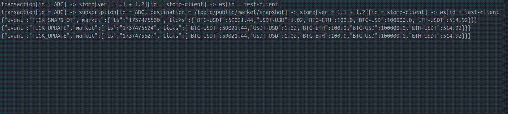

# WebSocket and STOMP Client Library

A robust Java library for efficient WebSocket and STOMP (Simple Text Oriented Messaging Protocol) communication over
WebSocket connections.

## Features

- ⚛️ Built with Reactor for efficient, non-blocking reactive streams
- 🔄 Seamless integration with reactive applications
- 🚀 High-performance asynchronous processing
- 📦 Minimal external libraries required (okhttp3 + reactor)

### WebSocket Client

- 🔌 Seamless WebSocket connection setup
- 📤 Effortless message sending and receiving
- 🔍 Real-time status monitoring
- ⚙️ Flexible connection and disconnection configuration

### STOMP Client

- 🚀 WebSocket-based STOMP client (v1.0, 1.1, 1.2 supported)
- 🔗 Intuitive connection and subscription management
- 💼 Comprehensive STOMP transaction support
- 🛠️ Highly configurable connection parameters

## Quick Demo

Check out this quick demo of our WebSocket and STOMP Client Library in action:




## Installation

Add the following dependency to your `pom.xml`:

```xml

<dependency>
  <groupId>com.connector.common</groupId>
  <artifactId>stomp-client-java</artifactId>
  <version>0.0.1-SNAPSHOT</version>
</dependency>
```

## Usage

### WebSocket Client

```java
import com.connector.common.websocket.client.WSClient;
import com.connector.common.websocket.constant.WSStatus;
import com.connector.common.websocket.internal.config.WSConnectConfig;
import com.connector.common.websocket.internal.config.WSDisconnectConfig;
import com.connector.common.websocket.internal.model.WSRawMessage;

import java.time.Duration;

public class WebSocketExample
{
    public static void main(String[] args)
    {
        WSClient client = new WSClient("example-client");

        // Connect to WebSocket server
        WSConnectConfig connectConfig = new WSConnectConfig("wss://example.com/websocket", client -> client, req -> req);
        client.connect(connectConfig);
        client.waitConnectionStatus(WSStatus.OPEN).block();

        // Send a message
        client.sendMessage(WSRawMessage.text("Hello, WebSocket!"));

        // Receive messages
        client.responseStream().subscribe(response -> {
            String message = response.getBody().getStringData();
            System.out.println("Received: " + message);
        });

        // Monitor WebSocket status
        client.socketStatusStream().subscribe(status -> System.out.println("WebSocket status: " + status));

        // Disconnect
        client.disconnect(new WSDisconnectConfig(false, 1000, "Normal disconnect"));
        client.waitConnectionStatus(WSStatus.CLOSED).block();
    }
}
```

### STOMP client

```java 
import com.connector.common.stomp.client.WSStompClientV11;
import com.connector.common.stomp.client.WSStompSubscriptionV11;
import com.connector.common.stomp.constant.StompConnectionStatus;
import com.connector.common.stomp.constant.StompSubscriptionStatus;
import com.connector.common.websocket.constant.WSStatus;
import com.connector.common.stomp.constant.StompAckMode;
import com.connector.common.stomp.constant.StompVersion;
import com.connector.common.stomp.internal.config.StompConnectConfigV11;
import com.connector.common.websocket.client.WSClient;
import com.connector.common.websocket.internal.config.WSConnectConfig;
import reactor.core.Disposable;
import reactor.core.scheduler.Schedulers;

import java.time.Duration;
import java.time.OffsetDateTime;
import java.util.Arrays;
import java.util.concurrent.Executors;
import java.util.concurrent.ScheduledExecutorService;

public class StompExample
{
    public static void main(String[] args) throws Throwable
    {
        WSClient wsClient = new WSClient("example-ws-client");

        // Connect to WebSocket server
        WSConnectConfig wsConfig = new WSConnectConfig("wss://example.com/stomp", client -> client, req -> req);
        wsClient.connect(connectConfig);
        wsClient.waitConnectionStatus(WSStatus.OPEN).block();

        // Connect to STOMP server
        StompConnectConfigV11<Void> stompConnectConfig = new StompConnectConfigV11<>(null, "example.com", Arrays.asList(StompVersion.STOMP_1_0, StompVersion.STOMP_1_1, StompVersion.STOMP_1_2), null, null, Duration.ofSeconds(60), Duration.ofSeconds(60), Executors.newSingleThreadScheduledExecutor());
        WSStompClientV11 stompClient = new WSStompClientV11("example-stomp-client", wsClient);
        stompClient.connectStomp(stompConnectConfig);
        stompClient.waitConnectionStatus(StompConnectionStatus.CONNECTED).block();

        // Log heartbeat of stomp client
        stompClient.deliverMessageStream().doOnNext(msg -> {
            if (msg.getType() == StompFrameType.HEARTBEAT)
            {
                System.out.println("Heartbeat received " + OffsetDateTime.now());
            }
        }).subscribe();

        String topic = "/topic/example";
        String subscriptionId = "ABC";

        // Create subscription and subscribe to a stomp topic
        WSStompSubscriptionV11 subscription = new WSStompSubscriptionV11(topic, subscriptionId, StompAckMode.CLIENT, stompClient);
        subscription.registerAdditionalRequestHandler(req -> {
            // Perform additional processing of request here (authentication, logging, ...)
            return req;
        });
        subscription.registerResponseHandler(resp -> {
            // Perform additional processing on the received response before ack message, for example persist to database, if error return exception to nack the response, etc...
            return null;
        });

        // Wait for subscribed confirmation by sending a receipt id to the server (if the server support subscribe message with receipt)
        subscription.waitReceipt(subscription.subscribe("receiptId")).block();
        // Or ignore it entirely if the server not support this
        // subscription.subscribe(null);
        // Or like this
        // subscription.waitReceipt(subscription.subscribe(null)).block();

        // Either way subscription status can be waited either way
        subscription.waitSubscriptionStatus(StompSubscriptionStatus.SUBSCRIBED).block();

        // Start a processor to receive and process messages stream
        Disposable d = subscription.deliverMessageStream().doOnNext(msg -> System.out.println("Received: " + msg.getBody())).doOnError(Throwable::printStackTrace).subscribe();

        // Start a secondary processor for backup process topic message stream or specialized processing
        Disposable secondaryD = subscription.deliverMessageStream().doOnNext(msg -> {
            // Secondary processing stream of same topic - subscription id
        }).subscribe();

        // Unsubscribe from processing message stream if error happened somewhere in the main processing stream
        subscription.waitSubscriptionStatus(StompSubscriptionStatus.UNSUBSCRIBED).subscribe(v -> {
            System.out.println("Unsubscribed from stomp topic");

            // Destroy processor
            d.dispose();
            secondaryD.dispose();
        });
    }
}
```

## Contributing

Contributions are welcome! Please feel free to submit a Pull Request.

## License

This project is licensed under the MIT License - see the [LICENSE](LICENSE) file for details.
