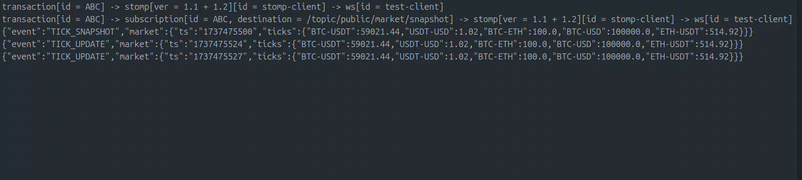

# WebSocket and STOMP Client Library

A robust Java library for efficient WebSocket and STOMP (Simple Text Oriented Messaging Protocol) communication over
WebSocket connections.

## Features

### WebSocket Client

- 🔌 Seamless WebSocket connection setup
- 📤 Effortless message sending and receiving
- 🔍 Real-time status monitoring
- ⚙️ Flexible connection and disconnection configuration

### STOMP Client

- 🚀 WebSocket-based STOMP client (v1.0, 1.1, 1.2 supported)
- 🔗 Intuitive connection and subscription management
- 💼 Comprehensive STOMP transaction support
- 🛠️ Highly configurable connection parameters

## Quick Demo

Check out this quick demo of our WebSocket and STOMP Client Library in action:



## Installation

Add the following dependency to your `pom.xml`:

```xml

<dependency>
  <groupId>com.connector.common</groupId>
  <artifactId>stomp-client-java</artifactId>
  <version>0.0.1-SNAPSHOT</version>
</dependency>
```

## Usage

### WebSocket Client

```java
import com.connector.common.websocket.client.WSClient;
import com.connector.common.websocket.internal.config.WSConnectConfig;
import com.connector.common.websocket.internal.config.WSDisconnectConfig;
import com.connector.common.websocket.internal.model.WSRequest;
import com.connector.common.websocket.internal.model.WSRawMessage;

import java.time.Duration;

public class WebSocketExample
{
    public static void main(String[] args)
    {
        WSClient client = new WSClient("example-client");

        // Connect to WebSocket server
        WSConnectConfig connectConfig = new WSConnectConfig("wss://example.com/websocket", Duration.ofSeconds(3), Duration.ofSeconds(3), Duration.ofSeconds(3));
        client.connect(connectConfig, req -> req);

        // Send a message
        client.sendMessage(WSRequest.message(WSRawMessage.text("Hello, WebSocket!")));

        // Receive messages
        client.responseStream().subscribe(response -> {
            String message = response.getBody().getStringData();
            System.out.println("Received: " + message);
        });

        // Monitor WebSocket status
        client.socketStatusStream().subscribe(status -> System.out.println("WebSocket status: " + status));

        // Disconnect
        client.disconnect(new WSDisconnectConfig(false, 1000, "Normal disconnect"));
    }
}
```

### STOMP client

```java 
import com.connector.common.stomp.client.WSStompClientV11;
import com.connector.common.stomp.client.WSStompSubscriptionV11;
import com.connector.common.stomp.constant.StompAckMode;
import com.connector.common.stomp.constant.StompVersion;
import com.connector.common.stomp.internal.config.StompConnectConfigV11;
import com.connector.common.stomp.internal.config.StompDisconnectConfigV11;
import com.connector.common.websocket.client.WSClient;
import com.connector.common.websocket.internal.config.WSConnectConfig;
import reactor.core.scheduler.Schedulers;

import java.time.Duration;
import java.util.Arrays;

public class StompExample
{
    public static void main(String[] args) throws Throwable
    {
        WSClient wsClient = new WSClient("example-ws-client");

        // Connect to WebSocket server
        WSConnectConfig wsConfig = new WSConnectConfig("wss://example.com/stomp", Duration.ofSeconds(3), Duration.ofSeconds(3), Duration.ofSeconds(3));
        wsClient.connect(wsConfig, req -> req);

        // Connect to STOMP server
        StompConnectConfigV11<?> stompConfig = new StompConnectConfigV11<>(Duration.ofSeconds(20), new StompDisconnectConfigV11(true, null, Duration.ofSeconds(3)), "example.com", Arrays.asList(StompVersion.STOMP_1_0, StompVersion.STOMP_1_1, StompVersion.STOMP_1_2), null, null, Duration.ofSeconds(60), Duration.ofSeconds(60));
        WSStompClientV11 stompClient = new WSStompClientV11("example-stomp-client", wsClient, Schedulers.boundedElastic());
        stompClient.connectStomp(stompConfig);

        // Create and subscribe to a topic
        WSStompSubscriptionV11 subscription = new WSStompSubscriptionV11("/topic/example", "subscription-id", StompAckMode.CLIENT, stompClient);
        subscription.registerRequestHandler(req -> {
            // Perform additional processing of request here (authentication, logging, ...)
            return req;
        });
        subscription.subscribe();

        // Receive messages
        subscription.deliverMessageStream().doOnNext(msg -> System.out.println("Received: " + msg.getBody())).doOnError(Throwable::printStackTrace).subscribe();
    }
}
```

## Contributing

Contributions are welcome! Please feel free to submit a Pull Request.

## License

This project is licensed under the MIT License - see the [LICENSE](LICENSE) file for details.